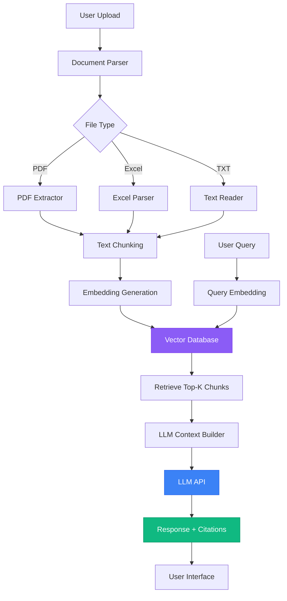
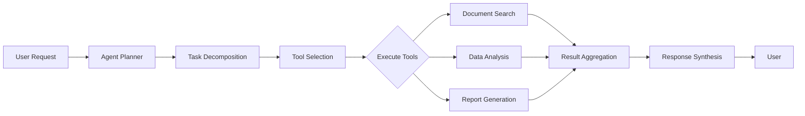

# Vishnu Agentic Capabilities Roadmap

> **Document Purpose**: Comprehensive implementation guide for adding RAG (Retrieval-Augmented Generation) and agentic capabilities to the Vishnu AI Assistant.

---

## 📋 Table of Contents

1. [Overview](#overview)
2. [Architecture](#architecture)
3. [Phase 1: RAG Foundation](#phase-1-rag-foundation)
4. [Phase 2: Document Processing Pipeline](#phase-2-document-processing-pipeline)
5. [Phase 3: LLM Integration](#phase-3-llm-integration)
6. [Phase 4: Agentic Workflows](#phase-4-agentic-workflows)
7. [Phase 5: Advanced Features](#phase-5-advanced-features)
8. [Infrastructure Requirements](#infrastructure-requirements)
9. [Cost Estimates](#cost-estimates)
10. [Security Considerations](#security-considerations)

---

## Overview

### What is RAG?

**RAG (Retrieval-Augmented Generation)** is a technique that enhances LLM responses by:
1. **Retrieving** relevant context from your documents
2. **Augmenting** the LLM prompt with this context
3. **Generating** accurate, grounded responses

### What are Agentic Capabilities?

**Agentic AI** refers to systems that can:
- Plan multi-step tasks autonomously
- Use tools and APIs to accomplish goals
- Make decisions based on context
- Execute complex workflows without human intervention

### Vision for Vishnu

Vishnu will be a **Perplexity-style intelligent assistant** that:
-  Understands and analyzes uploaded documents (PDF, Excel, TXT)
-  Answers questions with citations and sources
-  Performs complex multi-document analysis
-  Executes business workflows autonomously
-  Generates insights, reports, and summaries
-  Learns from interactions to improve over time

---

## Architecture



### Core Components

| Component | Purpose | Technology Options |
|-----------|---------|-------------------|
| **Document Parser** | Extract text from files | pdf-parse, xlsx, mammoth |
| **Text Chunker** | Split text into semantic chunks | LangChain, custom recursive splitter |
| **Embedding Model** | Convert text to vectors | OpenAI Ada-002, Sentence Transformers |
| **Vector Database** | Store and search embeddings | **ChromaDB** (recommended), Weaviate, Qdrant, pgvector |
| **LLM** | Generate responses | OpenAI GPT-4, Anthropic Claude, Gemini |
| **Agent Framework** | Orchestrate agentic workflows | LangChain, AutoGPT, CrewAI |

---

## Phase 1: RAG Foundation

### Goals
- Set up vector database
- Implement basic document embedding
- Create simple query-response flow

### Steps

#### 1.1 Install Dependencies

```bash
npm install chromadb openai langchain pdf-parse xlsx
npm install --save-dev @types/pdf-parse
```

#### 1.2 Set Up Environment Variables

```env
# .env.local
OPENAI_API_KEY=sk-...
# ChromaDB runs locally by default, no API key needed for development
# For production, you can use Chroma Cloud:
# CHROMA_SERVER_URL=https://your-chroma-instance.com
# CHROMA_API_KEY=your-api-key
```

#### 1.3 Create Vector Database Client

**File**: `src/lib/vectordb/chroma-client.ts`

```typescript
import { ChromaClient } from 'chromadb';

let client: ChromaClient | null = null;

export async function getChromaClient() {
  if (!client) {
    client = new ChromaClient({
      path: process.env.CHROMA_SERVER_URL || 'http://localhost:8000',
    });
  }
  return client;
}

export async function getOrCreateCollection(name: string = 'vishnu-documents') {
  const client = await getChromaClient();
  try {
    return await client.getOrCreateCollection({
      name,
      metadata: { 'hnsw:space': 'cosine' },
    });
  } catch (error) {
    console.error('Error getting/creating collection:', error);
    throw error;
  }
}
```

#### 1.4 Create Embedding Service

**File**: `src/lib/embeddings/openai-embeddings.ts`

```typescript
import OpenAI from 'openai';

const openai = new OpenAI({
  apiKey: process.env.OPENAI_API_KEY,
});

export async function generateEmbedding(text: string): Promise<number[]> {
  const response = await openai.embeddings.create({
    model: 'text-embedding-ada-002',
    input: text,
  });
  return response.data[0].embedding;
}
```

#### 1.5 Create Document Processing Service

**File**: `src/lib/documents/processor.ts`

```typescript
import pdf from 'pdf-parse';
import xlsx from 'xlsx';
import fs from 'fs/promises';

export async function extractText(filePath: string, fileType: string): Promise<string> {
  switch (fileType) {
    case 'pdf':
      const pdfBuffer = await fs.readFile(filePath);
      const pdfData = await pdf(pdfBuffer);
      return pdfData.text;
    
    case 'xlsx':
    case 'xls':
      const workbook = xlsx.readFile(filePath);
      let text = '';
      workbook.SheetNames.forEach(sheetName => {
        const sheet = workbook.Sheets[sheetName];
        text += xlsx.utils.sheet_to_csv(sheet) + '\n';
      });
      return text;
    
    case 'txt':
      return await fs.readFile(filePath, 'utf-8');
    
    default:
      throw new Error(`Unsupported file type: ${fileType}`);
  }
}
```

#### 1.6 Create Text Chunking Service

**File**: `src/lib/documents/chunker.ts`

```typescript
export interface Chunk {
  text: string;
  metadata: {
    documentId: string;
    chunkIndex: number;
    totalChunks: number;
  };
}

export function chunkText(
  text: string,
  documentId: string,
  chunkSize: number = 1000,
  overlap: number = 200
): Chunk[] {
  const chunks: Chunk[] = [];
  let startIndex = 0;
  let chunkIndex = 0;

  while (startIndex < text.length) {
    const endIndex = Math.min(startIndex + chunkSize, text.length);
    const chunkText = text.slice(startIndex, endIndex);
    
    chunks.push({
      text: chunkText,
      metadata: {
        documentId,
        chunkIndex,
        totalChunks: 0, // Will be updated
      },
    });

    startIndex += chunkSize - overlap;
    chunkIndex++;
  }

  // Update total chunks
  chunks.forEach(chunk => {
    chunk.metadata.totalChunks = chunks.length;
  });

  return chunks;
}
```

#### 1.7 Create Upload API Route

**File**: `src/app/api/vishnu/upload/route.ts`

```typescript
import { NextRequest, NextResponse } from 'next/server';
import { writeFile, mkdir } from 'fs/promises';
import { join } from 'path';
import { extractText } from '@/lib/documents/processor';
import { chunkText } from '@/lib/documents/chunker';
import { generateEmbedding } from '@/lib/embeddings/openai-embeddings';
import { getOrCreateCollection } from '@/lib/vectordb/chroma-client';
import { existsSync } from 'fs';

export async function POST(request: NextRequest) {
  try {
    const formData = await request.formData();
    const file = formData.get('file') as File;
    
    if (!file) {
      return NextResponse.json({ error: 'No file provided' }, { status: 400 });
    }

    // Save file temporarily
    const bytes = await file.arrayBuffer();
    const buffer = Buffer.from(bytes);
    const uploadDir = join(process.cwd(), 'uploads');
    
    // Create uploads directory if it doesn't exist
    if (!existsSync(uploadDir)) {
      await mkdir(uploadDir, { recursive: true });
    }
    
    const filePath = join(uploadDir, file.name);
    await writeFile(filePath, buffer);

    // Extract text
    const fileType = file.name.split('.').pop() || '';
    const text = await extractText(filePath, fileType);

    // Chunk text
    const documentId = `doc_${Date.now()}`;
    const chunks = chunkText(text, documentId);

    // Get ChromaDB collection
    const collection = await getOrCreateCollection();

    // Generate embeddings and prepare for ChromaDB
    const ids: string[] = [];
    const embeddings: number[][] = [];
    const metadatas: any[] = [];
    const documents: string[] = [];

    for (let idx = 0; idx < chunks.length; idx++) {
      const chunk = chunks[idx];
      const embedding = await generateEmbedding(chunk.text);
      
      ids.push(`${documentId}_chunk_${idx}`);
      embeddings.push(embedding);
      documents.push(chunk.text);
      metadatas.push({
        documentId: chunk.metadata.documentId,
        fileName: file.name,
        chunkIndex: idx,
        totalChunks: chunks.length,
      });
    }

    // Add to ChromaDB
    await collection.add({
      ids,
      embeddings,
      metadatas,
      documents,
    });

    return NextResponse.json({
      success: true,
      documentId,
      chunksProcessed: chunks.length,
    });
  } catch (error) {
    console.error('Upload error:', error);
    return NextResponse.json({ 
      error: 'Upload failed',
      details: error instanceof Error ? error.message : 'Unknown error'
    }, { status: 500 });
  }
}
```

#### 1.8 Create Query API Route

**File**: `src/app/api/vishnu/query/route.ts`

```typescript
import { NextRequest, NextResponse } from 'next/server';
import { generateEmbedding } from '@/lib/embeddings/openai-embeddings';
import { getOrCreateCollection } from '@/lib/vectordb/chroma-client';
import OpenAI from 'openai';

const openai = new OpenAI({
  apiKey: process.env.OPENAI_API_KEY,
});

export async function POST(request: NextRequest) {
  try {
    const { query } = await request.json();

    if (!query) {
      return NextResponse.json({ error: 'No query provided' }, { status: 400 });
    }

    // Generate query embedding
    const queryEmbedding = await generateEmbedding(query);

    // Get ChromaDB collection and search
    const collection = await getOrCreateCollection();
    const searchResults = await collection.query({
      queryEmbeddings: [queryEmbedding],
      nResults: 5,
    });

    // Check if we have results
    if (!searchResults.documents[0] || searchResults.documents[0].length === 0) {
      return NextResponse.json({
        response: "I don't have any documents to reference yet. Please upload some documents first!",
        sources: [],
      });
    }

    // Build context from results
    const context = searchResults.documents[0]
      .filter((doc): doc is string => doc !== null)
      .join('\n\n');

    // Generate response with LLM
    const completion = await openai.chat.completions.create({
      model: 'gpt-4-turbo-preview',
      messages: [
        {
          role: 'system',
          content: 'You are Vishnu, an intelligent document assistant. Answer questions based on the provided context. Always cite your sources. If the context doesn\'t contain relevant information, say so.',
        },
        {
          role: 'user',
          content: `Context:\n${context}\n\nQuestion: ${query}`,
        },
      ],
    });

    const response = completion.choices[0].message.content;

    // Extract sources from metadata
    const sources = searchResults.metadatas[0]
      ?.filter((meta): meta is Record<string, any> => meta !== null)
      .map((meta, idx) => ({
        fileName: meta.fileName as string,
        chunkIndex: meta.chunkIndex as number,
        distance: searchResults.distances?.[0]?.[idx] ?? 0,
      })) ?? [];

    return NextResponse.json({
      response,
      sources,
    });
  } catch (error) {
    console.error('Query error:', error);
    return NextResponse.json({ 
      error: 'Query failed',
      details: error instanceof Error ? error.message : 'Unknown error'
    }, { status: 500 });
  }
}
```

### Deliverables
- ✅ ChromaDB vector database setup
- ✅ Document upload and processing pipeline
- ✅ Query-response with RAG

### Starting ChromaDB Server

For development, ChromaDB can run in-memory (no setup needed) or as a server:

```bash
# Option 1: Run ChromaDB server locally (recommended for development)
pip install chromadb
chroma run --path ./chroma_data

# Option 2: Use Docker
docker pull chromadb/chroma
docker run -p 8000:8000 chromadb/chroma
```

For production, consider [Chroma Cloud](https://www.trychroma.com/) for managed hosting.

---

## Phase 2: Document Processing Pipeline

### Goals
- Enhanced document parsing (handle complex PDFs, tables)
- Metadata extraction
- Document versioning

### Advanced PDF Processing

```bash
npm install pdf2json tesseract.js
```

**Features to add**:
- OCR for scanned PDFs
- Table extraction
- Image extraction from PDFs
- Preserve document structure

### Excel Advanced Processing

**Features to add**:
- Sheet-by-sheet processing
- Formula extraction
- Chart data extraction
- Conditional formatting awareness

### Metadata Schema

```typescript
interface DocumentMetadata {
  id: string;
  fileName: string;
  fileType: string;
  fileSize: number;
  uploadedAt: Date;
  uploadedBy: string;
  extractedText: string;
  pageCount?: number;
  sheetCount?: number;
  tags: string[];
  summary: string;
  entities: string[]; // Extracted entities (names, dates, etc.)
}
```

---

## Phase 3: LLM Integration

### Multi-Model Support

Support multiple LLM providers for flexibility:

| Provider | Models | Best For |
|----------|--------|----------|
| **OpenAI** | GPT-4, GPT-4-Turbo | General tasks, coding |
| **Anthropic** | Claude 3 (Opus, Sonnet) | Long context, analysis |
| **Google** | Gemini 1.5 Pro | Multimodal, large context |
| **Local** | Llama 3, Mistral | Privacy, cost savings |

### Implementation

**File**: `src/lib/llm/multi-provider.ts`

```typescript
interface LLMProvider {
  generate(prompt: string, context: string): Promise<string>;
}

class OpenAIProvider implements LLMProvider {
  async generate(prompt: string, context: string): Promise<string> {
    // Implementation
  }
}

class AnthropicProvider implements LLMProvider {
  async generate(prompt: string, context: string): Promise<string> {
    // Implementation
  }
}

export function getLLMProvider(provider: string): LLMProvider {
  switch (provider) {
    case 'openai': return new OpenAIProvider();
    case 'anthropic': return new AnthropicProvider();
    default: throw new Error(`Unknown provider: ${provider}`);
  }
}
```

### Response Streaming

Implement streaming for real-time responses:

```typescript
export async function streamResponse(query: string) {
  const stream = await openai.chat.completions.create({
    model: 'gpt-4-turbo-preview',
    messages: [{ role: 'user', content: query }],
    stream: true,
  });

  const encoder = new TextEncoder();
  return new ReadableStream({
    async start(controller) {
      for await (const chunk of stream) {
        const text = chunk.choices[0]?.delta?.content || '';
        controller.enqueue(encoder.encode(text));
      }
      controller.close();
    },
  });
}
```

---

## Phase 4: Agentic Workflows

### Agent Architecture



### Agent Tools

**Tools the agent can use**:

1. **Document Search Tool**
   ```typescript
   async function searchDocuments(query: string): Promise<SearchResult[]>
   ```

2. **Data Analysis Tool**
   ```typescript
   async function analyzeData(data: any[], analysisType: string): Promise<Analysis>
   ```

3. **Report Generation Tool**
   ```typescript
   async function generateReport(data: any, template: string): Promise<string>
   ```

4. **Web Search Tool** (optional)
   ```typescript
   async function searchWeb(query: string): Promise<WebResult[]>
   ```

5. **Code Execution Tool** (sandboxed)
   ```typescript
   async function executeCode(code: string, language: string): Promise<any>
   ```

### LangChain Agent Implementation

```bash
npm install langchain @langchain/openai
```

**File**: `src/lib/agents/vishnu-agent.ts`

```typescript
import { ChatOpenAI } from '@langchain/openai';
import { AgentExecutor, createOpenAIFunctionsAgent } from 'langchain/agents';
import { DynamicTool } from '@langchain/core/tools';

export async function createVishnuAgent() {
  const llm = new ChatOpenAI({
    modelName: 'gpt-4-turbo-preview',
    temperature: 0,
  });

  const tools = [
    new DynamicTool({
      name: 'search_documents',
      description: 'Search through uploaded documents for relevant information',
      func: async (query: string) => {
        // Implementation
        return 'Search results...';
      },
    }),
    new DynamicTool({
      name: 'analyze_data',
      description: 'Perform statistical analysis on data from Excel files',
      func: async (params: string) => {
        // Implementation
        return 'Analysis results...';
      },
    }),
    // Add more tools
  ];

  const agent = await createOpenAIFunctionsAgent({
    llm,
    tools,
    prompt: systemPrompt,
  });

  return new AgentExecutor({
    agent,
    tools,
    verbose: true,
  });
}
```

### Workflow Orchestration

For complex multi-step workflows:

```typescript
interface Workflow {
  id: string;
  name: string;
  steps: WorkflowStep[];
}

interface WorkflowStep {
  id: string;
  action: string;
  params: any;
  dependsOn?: string[];
}

async function executeWorkflow(workflow: Workflow) {
  const results = new Map<string, any>();
  
  for (const step of workflow.steps) {
    // Wait for dependencies
    if (step.dependsOn) {
      await Promise.all(
        step.dependsOn.map(depId => results.get(depId))
      );
    }
    
    // Execute step
    const result = await executeStep(step);
    results.set(step.id, result);
  }
  
  return results;
}
```

---

## Phase 5: Advanced Features

### 1. Multi-Document Analysis

Compare and analyze multiple documents simultaneously:
- Cross-reference information
- Identify discrepancies
- Generate comparative reports

### 2. Conversational Memory

Remember conversation context:

```typescript
import { BufferMemory } from 'langchain/memory';

const memory = new BufferMemory({
  returnMessages: true,
  memoryKey: 'chat_history',
});
```

### 3. Document Summarization

Automatic summarization of uploaded documents:
- Extractive summarization (key sentences)
- Abstractive summarization (generated summary)
- Multi-level summaries (quick, detailed, comprehensive)

### 4. Entity Extraction

Extract and catalog important entities:
- People, organizations, locations
- Dates, monetary values
- Product names, project names

### 5. Question Answering Modes

- **Factual**: Direct answers from documents
- **Analytical**: Deep analysis and insights
- **Creative**: Generate new content based on documents
- **Comparative**: Compare multiple sources

### 6. Export Capabilities

- PDF reports with branding
- Excel dashboards
- PowerPoint presentations
- Notion/Markdown exports

---

## Infrastructure Requirements

### Production Deployment

#### Option 1: Serverless (Recommended for MVP)

**Stack**:
- **Frontend**: Vercel
- **Backend**: Vercel Edge Functions, AWS Lambda
- **Vector DB**: ChromaDB Cloud (managed) or self-hosted ChromaDB
- **File Storage**: AWS S3, Cloudflare R2
- **Database**: Vercel Postgres, Supabase

**Pros**: Easy to scale, minimal ops, pay-as-you-go
**Cons**: Can get expensive at high volume

#### Option 2: Self-Hosted

**Stack**:
- **Application**: Docker containers on AWS ECS/EKS
- **Vector DB**: Self-hosted Qdrant or Weaviate
- **File Storage**: S3-compatible (MinIO)
- **Database**: PostgreSQL with pgvector

**Pros**: Full control, potentially lower cost at scale
**Cons**: More operational complexity

### Resource Requirements

| Component | RAM | CPU | Storage |
|-----------|-----|-----|---------|
| Next.js App | 2GB | 1 vCPU | 10GB |
| Vector DB | 4GB | 2 vCPU | 50GB+ |
| Document Storage | - | - | 100GB+ |

---

## Cost Estimates

### Monthly Costs (1000 active users)

| Service | Usage | Cost |
|---------|-------|------|
| **OpenAI API** (GPT-4) | ~500K tokens/day | $450 |
| **OpenAI Embeddings** | ~2M tokens/day | $80 |
| **ChromaDB** (self-hosted) | 1 server, 100GB | $30-50 |
| **Vercel Pro** | Hosting | $20 |
| **AWS S3** | 500GB storage + transfer | $25 |
| **Total** | | **~$605-625/mo** |

### Cost Optimization Strategies

1. **Use GPT-3.5-Turbo** for simple queries (10x cheaper)
2. **Cache common queries** (Redis)
3. **Batch embeddings** where possible
4. **Use local models** for certain tasks (Llama 3)
5. **Implement rate limiting** per user

---

## Security Considerations

### Data Privacy

- ✅ Encrypt files at rest (AES-256)
- ✅ Encrypt in transit (TLS 1.3)
- ✅ User data isolation (multi-tenancy)
- ✅ Automatic PII detection and masking
- ✅ GDPR-compliant data deletion

### Access Control

```typescript
// Implement row-level security
interface DocumentAccess {
  documentId: string;
  userId: string;
  accessLevel: 'owner' | 'editor' | 'viewer';
  expiresAt?: Date;
}
```

### Rate Limiting

```typescript
// API route protection
import { Ratelimit } from '@upstash/ratelimit';

const ratelimit = new Ratelimit({
  redis,
  limiter: Ratelimit.slidingWindow(10, '10 s'),
});
```

---

## Getting Started Checklist

### Immediate Next Steps (Week 1-2)

- [x] Choose vector database (ChromaDB - completed!)
- [x] Install required npm packages (chromadb, openai, langchain, pdf-parse, xlsx)
- [ ] Set up ChromaDB server (local or Docker)
- [ ] Set up OpenAI API account and get API key
- [ ] Create ChromaDB collection (auto-created on first use)
- [ ] Implement Phase 1 upload API
- [ ] Implement Phase 1 query API
- [ ] Connect UI to backend APIs
- [ ] Test with sample documents

### Short Term (Month 1)

- [ ] Enhance document parsing (OCR, tables)
- [ ] Add user authentication and document ownership
- [ ] Implement conversation history
- [ ] Add streaming responses
- [ ] Create admin dashboard for monitoring

### Medium Term (Month 2-3)

- [ ] Implement agentic workflows
- [ ] Add multi-model LLM support
- [ ] Build report generation
- [ ] Create export capabilities
- [ ] Performance optimizations

### Long Term (Month 4+)

- [ ] Advanced analytics dashboard
- [ ] Fine-tune custom models
- [ ] Mobile app (React Native)
- [ ] API for third-party integrations
- [ ] Enterprise features (SSO, audit logs)

---

## Conclusion

This roadmap provides a comprehensive path from the current beautiful UI to a fully functional, Perplexity-style intelligent assistant with RAG and agentic capabilities.

**Key Success Factors**:
1. **Start Simple**: Implement Phase 1 completely before moving on
2. **Iterate Quickly**: Get user feedback early and often
3. **Measure Everything**: Track costs, latency, accuracy
4. **Prioritize UX**: Keep the beautiful UI while adding functionality
5. **Think Scale**: Design for 10x growth from day one

**Questions or Need Help?**
- Review OpenAI documentation: https://platform.openai.com/docs
- LangChain docs: https://docs.langchain.com
- Pinecone docs: https://docs.pinecone.io

---

**Document Version**: 1.0  
**Last Updated**: November 2024  
**Maintainer**: Vishnu AI Team
